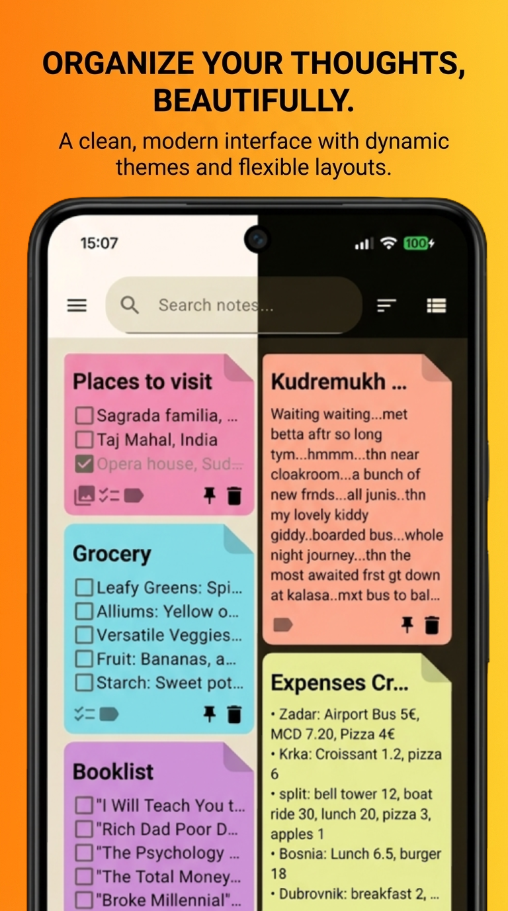
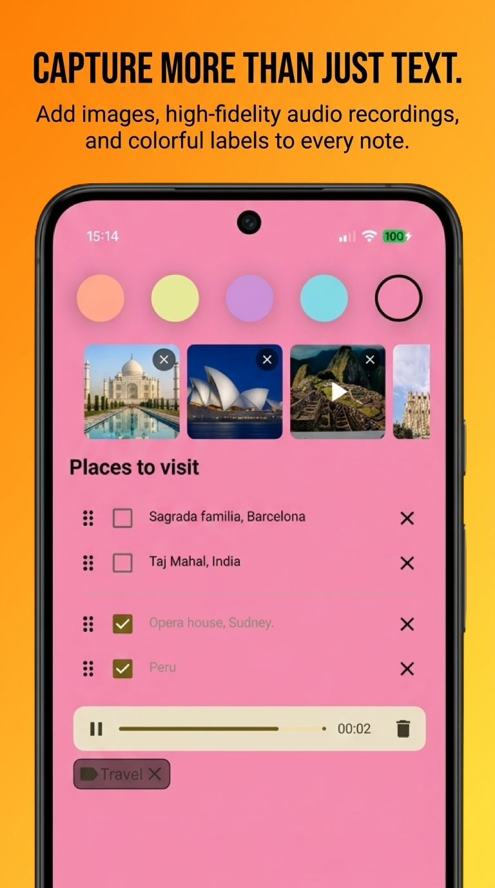
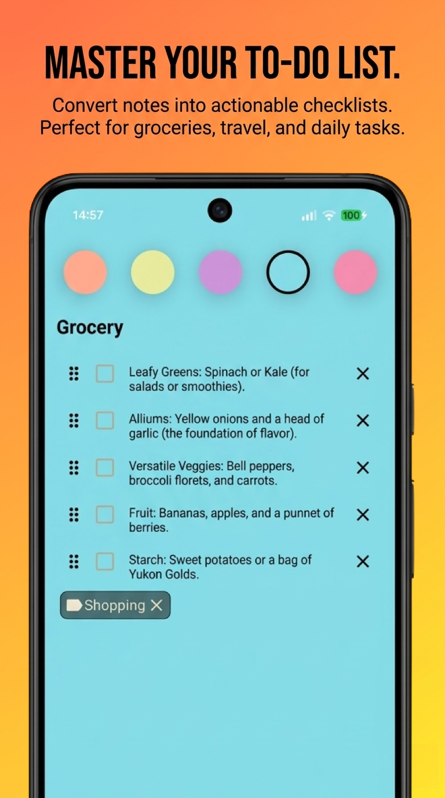
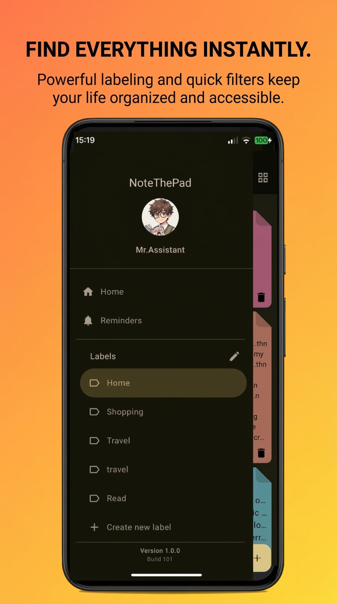
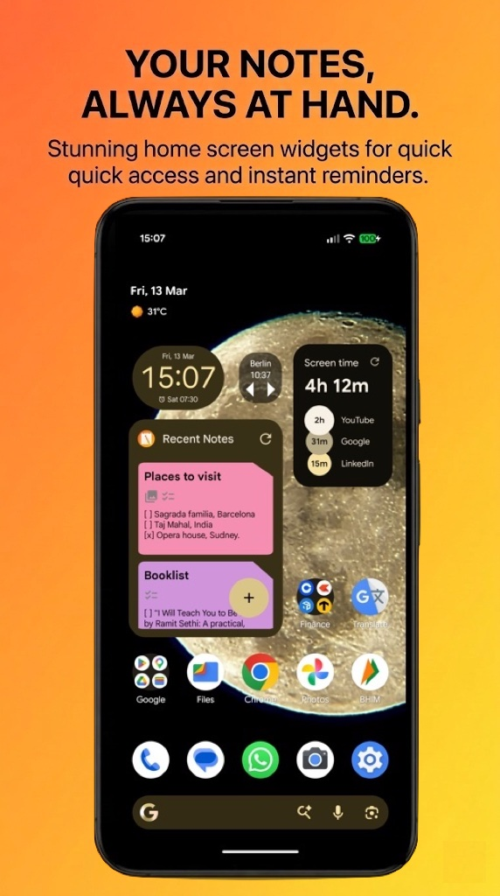

# NoteThePad

### Agentic AI Note-Taking for Android


**NoteThePad** is a privacy-focused productivity app that transforms notes into an intelligent workspace. Powered by on-device Gemma models, Gemini Nano, and Gemini 3 Flash, it provides agentic AI features that organize, summarize, and act on your content automatically.

---

## Screenshots

|             **Beautiful Interfaces**              |                **Rich Multimedia**                |               **Smart Checklists**                |
|:-------------------------------------------------:|:-------------------------------------------------:|:-------------------------------------------------:|
|  |  |  |
|                 *Dynamic Theming*                 |             *Images, Videos, Audios*              |            *Actionable Tasks, Labels*             |

|                 **Quick Filters**                 |                    **Widgets**                    |
|:-------------------------------------------------:|:-------------------------------------------------:|
|  |  |
|              *Sort, Search, Filter*               |              *Single, Recent Notes*               |

---

## Agentic AI

NoteThePad uses on-device and cloud AI models as an intelligent agent that acts on your behalf:

- **Auto-Tagging** - Analyzes note content and automatically maps to existing or new labels
- **Audio Transcription** - Converts voice recordings to text using Gemini Nano speech recognition or on-device Gemma models
- **Image Analysis** - Describes images, suggests contextual actions (OCR, recipe extraction, document summarization)
- **Image Query** - Ask questions about images with streaming AI responses
- **Smart Suggestions** - Context-aware action items based on note content
- **Summarization** - Generates concise summaries from text, audio transcriptions, and image descriptions
- **Agentic Reminders** - During summarization, the AI detects time-sensitive content ("remind me tomorrow", "meeting on April 15") and autonomously calls tool functions to schedule reminders via AlarmManager

### Supported AI Models

| Tier | Model | Capabilities |
|------|-------|-------------|
| Cloud | Gemini 3 Flash | Text, vision, summarization, tagging |
| System | Gemini Nano | Text, audio transcription, summarization |
| Local | Gemma (via LiteRT) | Text, audio, vision, tool calling |

Local models are downloaded from Hugging Face and run entirely on-device for privacy.

---

## Key Features

### Notes & Organization
- Rich text editing with formatting
- Tags/labels with many-to-many relationships
- Checklists with checkbox conversion
- Search, sort, and filter by tags, date, color
- Archive and soft-delete with recovery
- Calendar view for date-based navigation

### Multimedia
- Attach images, audio recordings, and video
- In-app audio recording and playback
- Image capture and gallery integration

### Theming & Customization
- Material 3 with light, dark, and system-follow modes
- 11 note background colors (pastel light + dark variants)
- 12 decorative background patterns (pizza, blueprint, topography, mountain, etc.)
- 13 note shapes (sticky note, perforated paper, frosted glass, washi tape, pinned note, and more)

### Cloud & Sync
- **Google Drive Backup** - Automated daily, weekly, or monthly backups with optional media inclusion
- **SupaSync** - Real-time cloud sync via Supabase (Postgrest, Realtime, GoTrue)
- **Firebase Authentication** - Google sign-in for account management

### Widgets
- **Single Note Widget** - Pin any note to home screen with Glance 1.1.1
- **Notes List Widget** - Recent notes overview on home screen

### Reminders & Calendar
- Per-note reminders with exact alarm scheduling
- Calendar screen for viewing notes by date
- Boot-persistent alarm rescheduling

---

## Tech Stack

| Layer | Technology |
|-------|-----------|
| Language | Kotlin 2.1, Java 17 |
| UI | Jetpack Compose (100% declarative), Material 3 |
| DI | Dagger-Hilt with KSP |
| Database | Room with encrypted storage (Tink) |
| AI | Google AI SDK (Gemini), ML Kit GenAI, LiteRT (Gemma), MediaPipe |
| Networking | Supabase (Postgrest-kt, Realtime-kt, GoTrue-kt), Ktor |
| Backup | Google Drive API v3 |
| Auth | Firebase Authentication |
| Widgets | Glance 1.1.1 |
| Async | Kotlin Coroutines, Flow, WorkManager |
| Architecture | MVVM + Clean Architecture, multi-module |

---

## Module Structure

```
:app                  Entry point, MainActivity, navigation graph
:core:model           Pure Kotlin DTOs (Note, Settings, AiModel, CheckboxItem)
:core:data            Room DB, DAOs, repositories, DataStore, Tink encryption
:core:common          Utilities, Screen routes, NavigationConstants
:core:ui              Shared Compose components, Material 3 theme, NoteShapeDrawer
:core:ai              Gemini/Gemma/Nano clients, ML Kit, MediaPipe, tool calling
:core:backup          Google Drive backup/restore workers
:core:network         Supabase sync (Postgrest, Realtime, GoTrue)
:core:richtext        Rich text Compose components
:feature:note         Note CRUD screens, reminders, audio recorder
:feature:auth         Firebase auth, Google sign-in
:feature:settings     Settings UI, AI model selection, onboarding
:feature:widgets      Glance home screen widgets
:feature:calendar     Calendar screen
```

Dependency flow: `:feature` -> `:core` -> `:core:model`. No circular or feature-to-feature dependencies.

---

## Setup & Installation

### Prerequisites
- Android Studio Ladybug or later
- JDK 17 (system default Java 23 breaks Gradle)
- Android SDK 35 (Min SDK 26)

### Clone & Build

```bash
git clone https://github.com/ARandomDev/NoteThePad.git
cd NoteThePad
```

### API Keys

Create `local.properties` in the project root with:

```properties
# AI (core:ai module)
GEMINI_API_KEY=your_gemini_api_key
HUGGING_FACE_AUTH_TOKEN=your_hf_token
GITHUB_GIST_ACCESS_TOKEN=your_github_token
AI_CATELOG_GIST_URL=your_gist_url

# Cloud Sync (core:network module)
SUPABASE_URL=your_supabase_url
SUPABASE_ANON_KEY=your_supabase_key

# Backup (core:backup module)
DRIVE_CLIENT_ID=your_drive_client_id
DRIVE_CLIENT_SECRET=your_drive_client_secret
```

### Build

```bash
# Use Java 17 explicitly
export JAVA_HOME=/path/to/jdk17

# Debug build
./gradlew assembleDebug

# Run tests
./gradlew testDebugUnitTest

# Release build (requires keystore setup)
./gradlew bundleRelease
```

Release builds require `KEYSTORE_PASSWORD`, `KEY_ALIAS`, `KEY_PASSWORD` env vars and a keystore at `app/release.jks`.

---

## Architecture

Each feature module follows **MVVM + Clean Architecture**:

```
presentation/    Compose screens + ViewModels (StateFlow)
domain/          Use cases + repository interfaces
data/            Repository implementations
di/              Hilt @Module classes
```

State is managed with `StateFlow` and collected via `collectAsStateWithLifecycle`.

---

## License

```
Copyright 2024 NoteThePad

Licensed under the Apache License, Version 2.0
```
